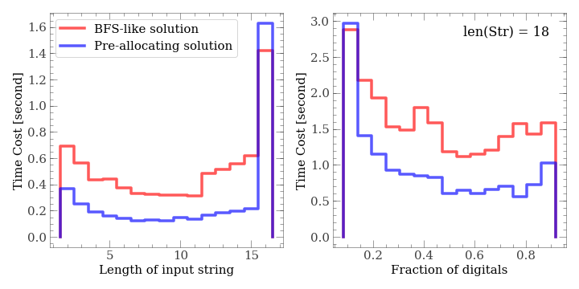

## Problem 784: Letter Case Permutation

problem: [letter case permutation](https://leetcode.com/problems/letter-case-permutation/)

### Solution

- [Python](../python/problem784.py)

- [C++](../cpp/problem784.cpp)

- [Swift](../swift/problem784.swift)

### Discussion

**Basic solution**

There is a basic way of solving this problem: the BFS-like traversal of leaves nodes. This is considered as following.

- Treat the NULL string as the root of the BFS tree.

- Traverse the input string `S`. For each charater, if it is a digital byte, extend a level of the tree by adding each leaf node this digital character (with number of leaf nodes unchanged). If it is a alphabetic byte, extent the tree by given each leaf a left child, with a lower-case character appended, and a right child, with a upper-case charater appended.

This solution is just a BFS traversal of the tree. So the time complexity is just proportional to the number of tree nodes: `n * 2^n`, where n is the length of input string. While space cost is about 2^n, for storing leaf nodes.


**Solution with pre-allocated memory**

References: Thank Ziyang for the discussion.

Since the number of leaf nodes can be calculated in advance, before traversing the tree. So we may allocate memory first. This can be done by the following function (C\+\+ for an example):

```c++
for(auto & c: S) c = toupper(c);
int n_alpha = count_if( S.cbegin(), S.cend(), [](int c)->bool{ return isalpha(c); } );
vector<string> res( pow(2, n_alpha), S );

```

The `n_alpha` keep record of the number of alphabetic byte in the input string. Then we allocate the memory immediately. Later implementation may expand the tree bottom-up (or instead, top-down).

```c++
for (int i = S.size() - 1, step = 1, n = res.size(); i >= 0; --i){
    if( isdigit(S[i]) ) continue;
    char c_lower = tolower(S[i]);
    for (int j = 0; j < n; j += step*2)
        for (int k = j; k < step+j; ++k)
            res[k][i] = c_lower;
    step *= 2;
}
```

The full function can be found in [source code](../cpp/problem784.cpp). Where an example to use solution is given in the `main` function. Here we also test the performance of the two methods by

- Let input string `S` only have alphabetic byte. Change the length of S, and test the performance of two solutions by repeatedly call the solutions. Below shows the result (t1 for the first solution, t2 for the pre-allocated solution, the change of number of repeats is to keep the total time cost unchanged with length of `S`):

```txt
len of str  repeat  t1      t2
2           2500000 0.692   0.370
3           1250000 0.563   0.249
4           625000  0.435   0.192
5           312500  0.442   0.157
6           156250  0.375   0.143
7           78125   0.328   0.125
8           39062   0.323   0.127
9           19531   0.317   0.125
10          9765    0.316   0.145
11          4882    0.313   0.136
12          2441    0.485   0.163
13          1220    0.516   0.183
14          610     0.558   0.199
15          305     0.616   0.216
16          152     1.419   1.626

```

- Or we let the length of `S` fixed, but change the fraction of digital bytes in `S`. Below shows the test of two solutions by keep length of `S` to be 18, with different fraction of digital bytes indicated in the first row:

```txt
fraction of number  t1      t2
0.889               1.584   1.024
0.833               1.428   0.721
0.778               1.570   0.564
0.722               1.391   0.700
0.667               1.209   0.663
0.611               1.154   0.603
0.556               1.121   0.647
0.500               1.184   0.608
0.444               1.587   0.832
0.389               1.804   0.854
0.333               1.488   0.873
0.278               1.535   0.924
0.222               1.934   1.154
0.167               2.182   1.413
0.111               2.887   2.966
```
The illustrative figure for the above performance testing is also here:



We note that since C++ allow the change of charaters in string directly, with no new structure generated. So the performance lifting is apparent. For many language like Python, Swift..., the internal string type is immutable, so the second solution may be inable to lift the performance.


